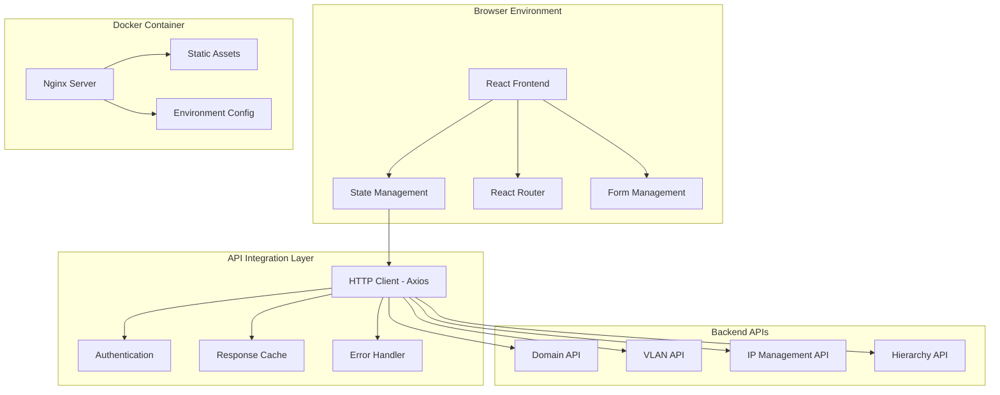
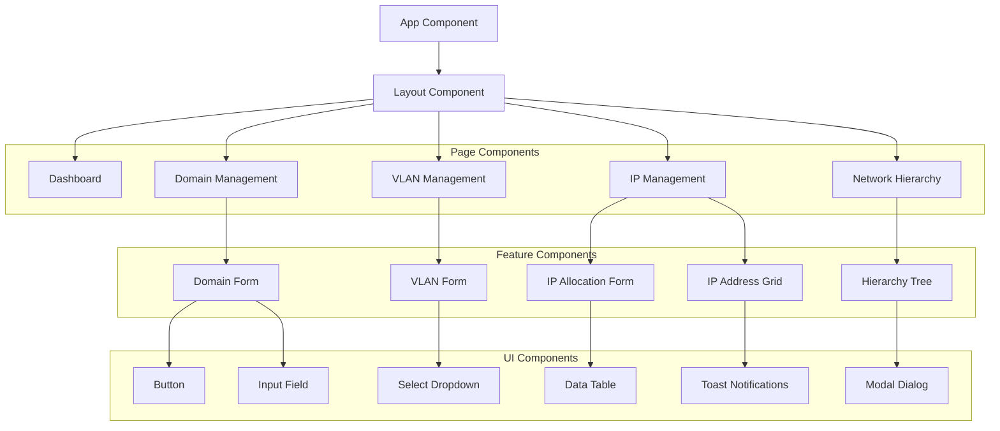

# Design Document: Frontend Interface for IP Management & VLAN Segmentation System

## Overview

The Frontend Interface is a modern, React-based web application that provides comprehensive operator-facing functionality for the IP Management & VLAN Segmentation System. Built with TypeScript and optimized for industrial environments, the interface emphasizes usability, performance, and reliability for network administrators, engineers, and technicians managing IT/OT infrastructure.

The design follows avant-garde minimalism principles while maintaining industrial-grade functionality. The interface is fully containerized using Docker, integrates seamlessly with existing REST APIs, and enforces all networking rules including reserved IP protection. The system is optimized for desktop and tablet usage in production environments.

## Architecture

### High-Level Architecture



### Component Architecture



## Components and Interfaces

### Core Application Structure

#### App Component
```typescript
interface AppProps {}

interface AppState {
  isAuthenticated: boolean;
  user: User | null;
  apiHealth: HealthStatus;
  globalError: string | null;
}

const App: React.FC<AppProps> = () => {
  // Global application state management
  // Authentication handling
  // API health monitoring
  // Global error boundary
};
```

#### Layout Component
```typescript
interface LayoutProps {
  children: React.ReactNode;
}

interface NavigationItem {
  name: string;
  href: string;
  icon: React.ComponentType;
  badge?: number;
}

const Layout: React.FC<LayoutProps> = ({ children }) => {
  // Sidebar navigation
  // Header with breadcrumbs
  // Mobile responsive design
  // User profile menu
};
```

### Domain Management Components

#### Domain Management Page
```typescript
interface Domain {
  id: string;
  name: DomainType;
  description: string;
  valueStreamCount: number;
  createdAt: string;
  updatedAt: string;
}

interface DomainManagementState {
  domains: Domain[];
  loading: boolean;
  error: string | null;
  selectedDomain: Domain | null;
  showCreateModal: boolean;
  showEditModal: boolean;
}

const DomainManagement: React.FC = () => {
  // Domain CRUD operations
  // Referential integrity validation
  // Bulk operations support
};
```

#### Domain Form Component
```typescript
interface DomainFormProps {
  domain?: Domain;
  onSubmit: (domain: DomainFormData) => Promise<void>;
  onCancel: () => void;
  mode: 'create' | 'edit';
}

interface DomainFormData {
  name: DomainType;
  description: string;
}

const DomainForm: React.FC<DomainFormProps> = ({ domain, onSubmit, onCancel, mode }) => {
  // Form validation
  // Domain type selection
  // Description input
  // Submit/cancel handling
};
```

### VLAN Management Components

#### VLAN Management Page
```typescript
interface VLAN {
  id: string;
  vlanId: number;
  subnet: string;
  subnetMask: number;
  defaultGateway: string;
  networkStart: string;
  networkEnd: string;
  zoneId: string;
  zoneName: string;
  zoneManager: string;
  lastFirewallCheck: string | null;
  firewall: string;
  ipAllocationCount: number;
  availableIpCount: number;
  createdAt: string;
  updatedAt: string;
}

interface VLANManagementState {
  vlans: VLAN[];
  zones: Zone[];
  loading: boolean;
  error: string | null;
  selectedVlan: VLAN | null;
  showCreateModal: boolean;
  showEditModal: boolean;
  filters: VLANFilters;
}

const VLANManagement: React.FC = () => {
  // VLAN CRUD operations
  // Zone filtering
  // Firewall assignment
  // IP utilization display
};
```

#### VLAN Form Component
```typescript
interface VLANFormProps {
  vlan?: VLAN;
  zones: Zone[];
  onSubmit: (vlan: VLANFormData) => Promise<void>;
  onCancel: () => void;
  mode: 'create' | 'edit';
}

interface VLANFormData {
  vlanId: number;
  subnet: string;
  subnetMask: number;
  defaultGateway: string;
  zoneId: string;
  zoneManager: string;
  firewall: string;
  lastFirewallCheck?: string;
}

const VLANForm: React.FC<VLANFormProps> = ({ vlan, zones, onSubmit, onCancel, mode }) => {
  // VLAN ID validation
  // Subnet calculation
  // Zone selection
  // Firewall assignment
  // Manager assignment
};
```

### IP Management Components

#### IP Management Page
```typescript
interface IPAllocation {
  id: string;
  vlanId: string;
  vlanName: string;
  ciName: string;
  macAddress: string;
  ipAddress: string;
  description: string;
  allocationType: 'MANUAL' | 'AUTOMATIC';
  isReserved: boolean;
  createdAt: string;
  updatedAt: string;
}

interface IPManagementState {
  allocations: IPAllocation[];
  vlans: VLAN[];
  selectedVlan: VLAN | null;
  loading: boolean;
  error: string | null;
  showAllocationModal: boolean;
  allocationMode: 'manual' | 'automatic';
  reservedIps: string[];
  availableIps: string[];
}

const IPManagement: React.FC = () => {
  // IP allocation operations
  // Reserved IP visualization
  // MAC address validation
  // Duplicate prevention
};
```

#### IP Allocation Form
```typescript
interface IPAllocationFormProps {
  vlan: VLAN;
  allocation?: IPAllocation;
  availableIps: string[];
  reservedIps: string[];
  onSubmit: (allocation: IPAllocationFormData) => Promise<void>;
  onCancel: () => void;
  mode: 'create' | 'edit';
  allocationType: 'manual' | 'automatic';
}

interface IPAllocationFormData {
  ciName: string;
  macAddress: string;
  ipAddress?: string; // Optional for automatic allocation
  description: string;
}

const IPAllocationForm: React.FC<IPAllocationFormProps> = ({
  vlan, allocation, availableIps, reservedIps, onSubmit, onCancel, mode, allocationType
}) => {
  // CI name input
  // MAC address validation
  // IP address selection (manual mode)
  // Description input
  // Reserved IP prevention
};
```

### Hierarchy Navigation Components

#### Hierarchy Tree Component
```typescript
interface HierarchyNode {
  id: string;
  name: string;
  type: 'domain' | 'valueStream' | 'zone' | 'vlan';
  children: HierarchyNode[];
  metadata: {
    securityLevel?: string;
    manager?: string;
    ipCount?: number;
    vlanCount?: number;
  };
}

interface HierarchyTreeProps {
  data: HierarchyNode[];
  onNodeSelect: (node: HierarchyNode) => void;
  selectedNodeId?: string;
  expandedNodes: Set<string>;
  onToggleExpand: (nodeId: string) => void;
}

const HierarchyTree: React.FC<HierarchyTreeProps> = ({
  data, onNodeSelect, selectedNodeId, expandedNodes, onToggleExpand
}) => {
  // Recursive tree rendering
  // Node expansion/collapse
  // Selection handling
  // Metadata display
};
```

### Shared UI Components

#### Data Table Component
```typescript
interface Column<T> {
  key: keyof T;
  title: string;
  render?: (value: any, record: T) => React.ReactNode;
  sortable?: boolean;
  filterable?: boolean;
  width?: string;
}

interface DataTableProps<T> {
  data: T[];
  columns: Column<T>[];
  loading?: boolean;
  pagination?: {
    current: number;
    pageSize: number;
    total: number;
    onChange: (page: number, pageSize: number) => void;
  };
  selection?: {
    selectedRowKeys: string[];
    onChange: (selectedRowKeys: string[]) => void;
  };
  actions?: {
    onCreate?: () => void;
    onEdit?: (record: T) => void;
    onDelete?: (record: T) => void;
  };
}

const DataTable = <T extends { id: string }>({
  data, columns, loading, pagination, selection, actions
}: DataTableProps<T>) => {
  // Table rendering
  // Sorting and filtering
  // Pagination
  // Row selection
  // Action buttons
};
```

#### Form Components
```typescript
interface InputFieldProps {
  label: string;
  name: string;
  type?: 'text' | 'email' | 'password' | 'number';
  value: string;
  onChange: (value: string) => void;
  error?: string;
  required?: boolean;
  placeholder?: string;
  disabled?: boolean;
  maxLength?: number;
  pattern?: string;
}

const InputField: React.FC<InputFieldProps> = ({
  label, name, type = 'text', value, onChange, error, required, placeholder, disabled, maxLength, pattern
}) => {
  // Input rendering
  // Validation display
  // Error handling
  // Accessibility support
};

interface SelectFieldProps {
  label: string;
  name: string;
  value: string;
  onChange: (value: string) => void;
  options: { value: string; label: string; disabled?: boolean }[];
  error?: string;
  required?: boolean;
  placeholder?: string;
  disabled?: boolean;
}

const SelectField: React.FC<SelectFieldProps> = ({
  label, name, value, onChange, options, error, required, placeholder, disabled
}) => {
  // Select dropdown rendering
  // Option filtering
  // Validation display
  // Keyboard navigation
};
```

## Data Models

### API Integration Models

#### API Client Configuration
```typescript
interface APIConfig {
  baseURL: string;
  timeout: number;
  retries: number;
  retryDelay: number;
}

interface APIResponse<T> {
  data: T;
  message?: string;
  errors?: string[];
  meta?: {
    pagination?: {
      page: number;
      pageSize: number;
      total: number;
      totalPages: number;
    };
  };
}

interface APIError {
  code: string;
  message: string;
  details?: Record<string, any>;
  timestamp: string;
  requestId?: string;
}
```

#### Domain Models
```typescript
enum DomainType {
  MFG = 'MFG',
  LOG = 'LOG',
  FCM = 'FCM',
  ENG = 'ENG'
}

enum SecurityLevel {
  SL3 = 'SL3',
  MFZ_SL4 = 'MFZ_SL4',
  LOG_SL4 = 'LOG_SL4',
  FMZ_SL4 = 'FMZ_SL4',
  ENG_SL4 = 'ENG_SL4',
  LRSZ_SL4 = 'LRSZ_SL4',
  RSZ_SL4 = 'RSZ_SL4'
}

interface Domain {
  id: string;
  name: DomainType;
  description: string;
  valueStreamCount: number;
  createdAt: string;
  updatedAt: string;
}

interface ValueStream {
  id: string;
  name: string;
  domainId: string;
  domainName: string;
  description?: string;
  zoneCount: number;
  createdAt: string;
  updatedAt: string;
}

interface Zone {
  id: string;
  name: string;
  securityLevel: SecurityLevel;
  valueStreamId: string;
  valueStreamName: string;
  manager: string;
  vlanCount: number;
  createdAt: string;
  updatedAt: string;
}
```

#### Network Models
```typescript
interface VLAN {
  id: string;
  vlanId: number;
  subnet: string;
  subnetMask: number;
  defaultGateway: string;
  networkStart: string;
  networkEnd: string;
  zoneId: string;
  zoneName: string;
  zoneManager: string;
  lastFirewallCheck: string | null;
  firewall: string;
  ipAllocationCount: number;
  availableIpCount: number;
  reservedIpCount: number;
  totalIpCount: number;
  utilizationPercentage: number;
  createdAt: string;
  updatedAt: string;
}

interface IPAllocation {
  id: string;
  vlanId: string;
  vlanName: string;
  ciName: string;
  macAddress: string;
  ipAddress: string;
  description: string;
  allocationType: 'MANUAL' | 'AUTOMATIC';
  isReserved: boolean;
  createdAt: string;
  updatedAt: string;
}

interface IPRange {
  start: string;
  end: string;
  type: 'reserved' | 'available' | 'allocated';
  count: number;
}
```

### State Management Models

#### Application State
```typescript
interface AppState {
  auth: AuthState;
  domains: DomainState;
  vlans: VLANState;
  ips: IPState;
  hierarchy: HierarchyState;
  ui: UIState;
}

interface AuthState {
  isAuthenticated: boolean;
  user: User | null;
  token: string | null;
  permissions: string[];
  loading: boolean;
  error: string | null;
}

interface DomainState {
  domains: Domain[];
  selectedDomain: Domain | null;
  loading: boolean;
  error: string | null;
  filters: DomainFilters;
  pagination: PaginationState;
}

interface VLANState {
  vlans: VLAN[];
  selectedVlan: VLAN | null;
  zones: Zone[];
  loading: boolean;
  error: string | null;
  filters: VLANFilters;
  pagination: PaginationState;
}

interface IPState {
  allocations: IPAllocation[];
  selectedAllocation: IPAllocation | null;
  vlans: VLAN[];
  selectedVlan: VLAN | null;
  availableIps: string[];
  reservedIps: string[];
  loading: boolean;
  error: string | null;
  filters: IPFilters;
  pagination: PaginationState;
}
```

## Correctness Properties

*A property is a characteristic or behavior that should hold true across all valid executions of a system—essentially, a formal statement about what the system should do. Properties serve as the bridge between human-readable specifications and machine-verifiable correctness guarantees.*

<function_calls>
<invoke name="prework">
<parameter name="featureName">frontend-interface

Based on the prework analysis, the following properties capture the essential correctness requirements for the frontend interface:

### Property 1: Domain Type Validation
*For any* domain creation attempt, only the four predefined domain types (MFG, LOG, FCM, ENG) must be accepted, and all other values must be rejected with appropriate error messages.
**Validates: Requirements 1.2**

### Property 2: Parent-Child Deletion Protection
*For any* parent entity with child entities, deletion attempts must be prevented and appropriate warnings must be displayed consistently across all hierarchy levels.
**Validates: Requirements 1.3, 2.4**

### Property 3: Required Field Display Consistency
*For any* entity display (domains, VLANs, IP allocations), all required information fields must be present and correctly populated in the user interface.
**Validates: Requirements 1.4, 3.3, 4.2**

### Property 4: Operation Feedback Consistency
*For any* successful operation (create, update, delete), immediate visual confirmation must be provided to the user consistently across all interface sections.
**Validates: Requirements 1.5, 4.7**

### Property 5: API Integration Completeness
*For any* CRUD operation, the correct backend API endpoint must be called with proper parameters and error handling.
**Validates: Requirements 1.6, 2.6, 3.7, 4.8, 7.1**

### Property 6: Security Level Validation
*For any* zone creation or modification, only the predefined security levels must be accepted, and invalid security levels must be rejected.
**Validates: Requirements 2.2**

### Property 7: Required Field Validation
*For any* form submission requiring specific fields (Zone Manager, Firewall Rule dates), the form must prevent submission when required fields are missing.
**Validates: Requirements 2.3, 3.2**

### Property 8: Hierarchical Navigation Consistency
*For any* parent-child relationship in the navigation, only valid child elements must be displayed for the selected parent entity.
**Validates: Requirements 2.5, 5.2**

### Property 9: VLAN Configuration Validation
*For any* VLAN creation or modification, subnet mathematical correctness must be validated and overlapping subnets within security zones must be prevented.
**Validates: Requirements 3.4, 3.5**

### Property 10: Firewall Assignment Display
*For any* VLAN display, the firewall assignment must be shown with the correct default value "bu4-fw-ha01" when no specific assignment exists.
**Validates: Requirements 3.3, 10.1**

### Property 11: Reserved IP Visual Indication
*For any* subnet display, the first 6 IP addresses and the last IP address must be visually marked as reserved and non-assignable.
**Validates: Requirements 4.2, 9.1, 9.2**

### Property 12: IP Allocation Prevention
*For any* IP allocation attempt, reserved IP addresses must be prevented from assignment with clear error messages displayed.
**Validates: Requirements 4.3, 9.4**

### Property 13: MAC Address Validation
*For any* MAC address input, the format must be validated and duplicate MAC addresses across the system must be prevented.
**Validates: Requirements 4.4**

### Property 14: IP Uniqueness Validation
*For any* IP address assignment within a VLAN, duplicate IP addresses must be prevented with appropriate error messages.
**Validates: Requirements 4.5**

### Property 15: Available IP Range Calculation
*For any* subnet configuration, available IP ranges must be calculated correctly excluding reserved ranges and allocated IPs.
**Validates: Requirements 9.3**

### Property 16: IP Status Display Accuracy
*For any* IP address in a subnet, the allocation status (allocated, available, reserved) must be displayed accurately and consistently.
**Validates: Requirements 9.5**

### Property 17: VLAN Utilization Statistics
*For any* VLAN, IP pool utilization statistics must be calculated and displayed correctly based on allocated, available, and reserved IP counts.
**Validates: Requirements 9.6**

### Property 18: Breadcrumb Navigation Accuracy
*For any* location in the hierarchy, breadcrumb navigation must accurately reflect the current position and allow navigation to parent levels.
**Validates: Requirements 5.3**

### Property 19: Responsive Design Consistency
*For any* viewport size within desktop and tablet ranges, the interface must maintain usability and visual consistency.
**Validates: Requirements 5.4**

### Property 20: User Action Feedback
*For any* user interaction (clicks, form submissions, navigation), consistent visual feedback must be provided to indicate system response.
**Validates: Requirements 5.6**

### Property 21: Client-Server Validation Consistency
*For any* validation rule, client-side validation must mirror backend business rules to provide consistent user experience.
**Validates: Requirements 6.1**

### Property 22: Error Message Specificity
*For any* validation error, specific and actionable error messages must be displayed to help users understand and correct the issue.
**Validates: Requirements 6.2**

### Property 23: Form Field Error Indication
*For any* invalid form field, clear visual indicators must highlight the problematic fields with appropriate styling.
**Validates: Requirements 6.3**

### Property 24: API Error Translation
*For any* backend API error, technical error messages must be translated into user-friendly language that operators can understand.
**Validates: Requirements 6.4**

### Property 25: Form State Preservation
*For any* form with validation errors, user input must be preserved during error correction to prevent data loss.
**Validates: Requirements 6.6**

### Property 26: UI Update Responsiveness
*For any* completed API operation, the user interface must update immediately to reflect the changes without requiring manual refresh.
**Validates: Requirements 7.2**

### Property 27: Loading State Indication
*For any* API request in progress, appropriate loading indicators must be displayed to inform users of system activity.
**Validates: Requirements 7.3**

### Property 28: Network Error Handling
*For any* network connectivity issue, proper error handling must be implemented with user-friendly error messages and recovery options.
**Validates: Requirements 7.4**

### Property 29: Environment Configuration Support
*For any* environment variable change, the application must respond correctly to configuration updates without requiring code changes.
**Validates: Requirements 7.5, 8.4**

### Property 30: API Timeout Handling
*For any* API request that exceeds timeout thresholds, appropriate timeout handling must be implemented with user notification.
**Validates: Requirements 7.6**

### Property 31: Container Startup Performance
*For any* container deployment, startup time must be optimized and container size must be minimized for efficient deployment.
**Validates: Requirements 8.6**

### Property 32: Zone Manager Information Display
*For any* VLAN detail view, zone manager information must be displayed correctly and consistently.
**Validates: Requirements 10.4**

### Property 33: Firewall Filter Functionality
*For any* firewall assignment filter, search and filtering capabilities must work correctly to find VLANs by firewall assignment.
**Validates: Requirements 10.5**

### Property 34: Firewall Review Highlighting
*For any* VLAN with firewall rule review dates, VLANs requiring review must be highlighted based on configurable date thresholds.
**Validates: Requirements 10.6**

### Property 35: Initial Load Performance
*For any* application startup under normal network conditions, the initial interface must load within the specified 3-second threshold.
**Validates: Requirements 11.1**

### Property 36: Pagination Functionality
*For any* large dataset (VLANs, IP allocations), pagination must be implemented correctly to manage data display and performance.
**Validates: Requirements 11.2**

### Property 37: Search Performance
*For any* search or filter operation on large datasets, performance must remain acceptable and results must be accurate.
**Validates: Requirements 11.3**

### Property 38: Data Caching Efficiency
*For any* frequently accessed data, caching must be implemented to minimize redundant API calls while maintaining data freshness.
**Validates: Requirements 11.4**

### Property 39: Hierarchical Rendering Performance
*For any* hierarchical data display, rendering performance must be optimized to handle large hierarchy structures efficiently.
**Validates: Requirements 11.5**

### Property 40: Concurrent Operation Handling
*For any* concurrent user operations, the system must handle them gracefully without data corruption or interface inconsistencies.
**Validates: Requirements 11.6**

### Property 41: Automatic Data Refresh
*For any* successful operation, data must refresh automatically across all relevant interface sections to maintain consistency.
**Validates: Requirements 12.1**

### Property 42: Conflict Resolution
*For any* concurrent modification scenario, appropriate conflict resolution must be implemented with user notification and resolution options.
**Validates: Requirements 12.2**

### Property 43: Cross-Section State Consistency
*For any* data change in one interface section, all other relevant sections must reflect the change to maintain consistent application state.
**Validates: Requirements 12.3**

### Property 44: Cache Freshness Management
*For any* cached data, freshness must be maintained through appropriate cache invalidation and refresh strategies.
**Validates: Requirements 12.5**

### Property 45: Navigation Data Preservation
*For any* browser navigation or refresh with unsaved changes, appropriate warnings must be displayed or data must be preserved to prevent loss.
**Validates: Requirements 12.6**

## Error Handling

### Error Handling Strategy

The frontend implements a comprehensive error handling system that provides user-friendly error messages while maintaining system stability:

#### Error Categories

1. **Validation Errors**: Client-side form validation failures
2. **API Errors**: Backend service errors and HTTP failures
3. **Network Errors**: Connectivity issues and timeouts
4. **Authentication Errors**: Login failures and session expiration
5. **Business Rule Errors**: Domain-specific constraint violations
6. **System Errors**: Unexpected application failures

#### Error Display Components

```typescript
interface ErrorBoundaryState {
  hasError: boolean;
  error: Error | null;
  errorInfo: ErrorInfo | null;
}

class ErrorBoundary extends React.Component<React.PropsWithChildren<{}>, ErrorBoundaryState> {
  // Global error boundary for unhandled exceptions
  // Error logging and reporting
  // Graceful fallback UI
}

interface ToastNotificationProps {
  type: 'success' | 'error' | 'warning' | 'info';
  title: string;
  message: string;
  duration?: number;
  onClose: () => void;
}

const ToastNotification: React.FC<ToastNotificationProps> = ({
  type, title, message, duration = 5000, onClose
}) => {
  // Toast notification display
  // Auto-dismiss functionality
  // User dismissal handling
};
```

#### Error Translation Service

```typescript
interface ErrorTranslationService {
  translateAPIError(error: APIError): UserFriendlyError;
  translateValidationError(field: string, rule: string): string;
  translateNetworkError(error: NetworkError): string;
}

interface UserFriendlyError {
  title: string;
  message: string;
  suggestions?: string[];
  recoveryActions?: RecoveryAction[];
}

interface RecoveryAction {
  label: string;
  action: () => void;
  primary?: boolean;
}
```

### Error Recovery Mechanisms

1. **Automatic Retry**: Network requests with exponential backoff
2. **Manual Retry**: User-initiated retry buttons for failed operations
3. **Offline Support**: Graceful degradation when backend is unavailable
4. **Form State Recovery**: Preservation of user input during errors
5. **Session Recovery**: Automatic re-authentication for expired sessions

## Testing Strategy

### Dual Testing Approach

The frontend employs both unit testing and property-based testing to ensure comprehensive coverage:

- **Unit tests**: Verify specific component behavior, user interactions, and edge cases
- **Property tests**: Verify universal properties across all component states and inputs
- Both approaches are complementary and necessary for comprehensive coverage

### Testing Framework Configuration

- **Testing Library**: Jest with React Testing Library for unit tests
- **Property Testing**: fast-check (JavaScript property-based testing library)
- **E2E Testing**: Playwright for end-to-end user workflow testing
- **Test Iterations**: Minimum 100 iterations per property test
- **Test Tagging**: Each property test references its design document property
- **Tag Format**: `// Feature: frontend-interface, Property {number}: {property_text}`

### Unit Testing Strategy

Unit tests focus on:
- **Component Rendering**: Correct component output for given props
- **User Interactions**: Click handlers, form submissions, navigation
- **State Management**: Component state updates and side effects
- **API Integration**: HTTP request handling and response processing
- **Error Scenarios**: Error boundary behavior and error display
- **Accessibility**: Screen reader compatibility and keyboard navigation

### Property Testing Strategy

Property tests focus on:
- **Form Validation**: Input validation across all possible input combinations
- **Data Display**: Correct data rendering for all possible data states
- **Navigation Behavior**: Consistent navigation across all hierarchy states
- **API Integration**: Correct API calls for all operation combinations
- **Error Handling**: Consistent error display for all error scenarios
- **Performance**: Response time consistency across different data volumes

### Test Organization

```
tests/
├── unit/
│   ├── components/
│   │   ├── DomainManagement.test.tsx
│   │   ├── VLANManagement.test.tsx
│   │   ├── IPManagement.test.tsx
│   │   └── HierarchyTree.test.tsx
│   ├── services/
│   │   ├── apiClient.test.ts
│   │   ├── validation.test.ts
│   │   └── errorHandler.test.ts
│   └── utils/
│       ├── formatters.test.ts
│       └── validators.test.ts
├── property/
│   ├── form-validation.property.test.ts
│   ├── data-display.property.test.ts
│   ├── navigation.property.test.ts
│   └── api-integration.property.test.ts
├── e2e/
│   ├── domain-management.e2e.test.ts
│   ├── vlan-management.e2e.test.ts
│   ├── ip-management.e2e.test.ts
│   └── user-workflows.e2e.test.ts
└── fixtures/
    ├── mockData.ts
    ├── apiMocks.ts
    └── testUtils.tsx
```

### Example Property Test Implementation

```typescript
import fc from 'fast-check';
import { render, screen } from '@testing-library/react';
import { DomainForm } from '../components/DomainForm';

describe('Domain Form Properties', () => {
  test('Property 1: Domain Type Validation', () => {
    // Feature: frontend-interface, Property 1: Domain Type Validation
    fc.assert(fc.property(
      fc.string({ minLength: 1, maxLength: 10 }),
      (domainName) => {
        const validDomains = ['MFG', 'LOG', 'FCM', 'ENG'];
        const isValid = validDomains.includes(domainName);
        
        const mockOnSubmit = jest.fn();
        render(
          <DomainForm 
            onSubmit={mockOnSubmit}
            onCancel={() => {}}
            mode="create"
          />
        );
        
        // Test that only valid domain types are accepted
        // and invalid ones are rejected with error messages
        
        if (isValid) {
          // Should accept valid domain types
          expect(/* validation passes */).toBe(true);
        } else {
          // Should reject invalid domain types
          expect(/* validation fails with error */).toBe(true);
        }
      }
    ), { numRuns: 100 });
  });
});
```

### Coverage Requirements

- **Minimum Coverage**: 80% code coverage for all components and services
- **Property Coverage**: Each correctness property must have corresponding property test
- **E2E Coverage**: All major user workflows must be tested end-to-end
- **Accessibility Coverage**: All interactive elements must pass accessibility tests
- **Performance Coverage**: All performance requirements must be validated through tests

### Continuous Integration

- **Automated Testing**: All tests run on every commit and pull request
- **Visual Regression Testing**: Screenshot comparison for UI consistency
- **Performance Testing**: Bundle size and runtime performance monitoring
- **Accessibility Testing**: Automated accessibility compliance checking
- **Cross-Browser Testing**: Testing across Chrome, Firefox, Safari, and Edge
- **Mobile Testing**: Responsive design testing on tablet viewports

The testing strategy ensures that the Frontend Interface maintains high reliability, usability, and performance standards while supporting rapid development and deployment cycles in industrial environments.

## Docker Configuration

### Multi-Stage Build Strategy

The frontend uses an optimized multi-stage Docker build process:

```dockerfile
# Build stage - Node.js environment for compilation
FROM node:18-alpine as builder
WORKDIR /app
COPY package*.json ./
RUN npm ci --only=production
COPY . .
ARG VITE_API_URL
ARG VITE_PLANT_CODE
ARG VITE_ORGANIZATION
ENV VITE_API_URL=${VITE_API_URL}
ENV VITE_PLANT_CODE=${VITE_PLANT_CODE}
ENV VITE_ORGANIZATION=${VITE_ORGANIZATION}
RUN npm run build

# Production stage - Nginx for serving static files
FROM nginx:1.25-alpine as production
COPY --from=builder /app/dist /usr/share/nginx/html
COPY nginx.conf /etc/nginx/nginx.conf
EXPOSE 80
HEALTHCHECK --interval=30s --timeout=10s --start-period=30s --retries=3 \
    CMD curl -f http://localhost:80/ || exit 1
CMD ["nginx", "-g", "daemon off;"]
```

### Environment Configuration

The application supports flexible configuration through environment variables:

```bash
# API Configuration
VITE_API_URL=http://localhost:8000/api/v1
VITE_PLANT_CODE=BURSA
VITE_ORGANIZATION="Bosch Rexroth"

# Performance Configuration
VITE_API_TIMEOUT=30000
VITE_CACHE_DURATION=300000
VITE_PAGINATION_SIZE=50

# Feature Flags
VITE_ENABLE_DEBUG=false
VITE_ENABLE_ANALYTICS=true
```

### Container Optimization

- **Image Size**: Multi-stage build reduces final image size to ~50MB
- **Startup Time**: Optimized for sub-5-second container startup
- **Security**: Non-root user execution and minimal attack surface
- **Health Checks**: Built-in health monitoring for container orchestration
- **Resource Limits**: Configured memory and CPU limits for production deployment

The Docker configuration ensures consistent deployment across development, staging, and production environments while maintaining optimal performance and security standards.