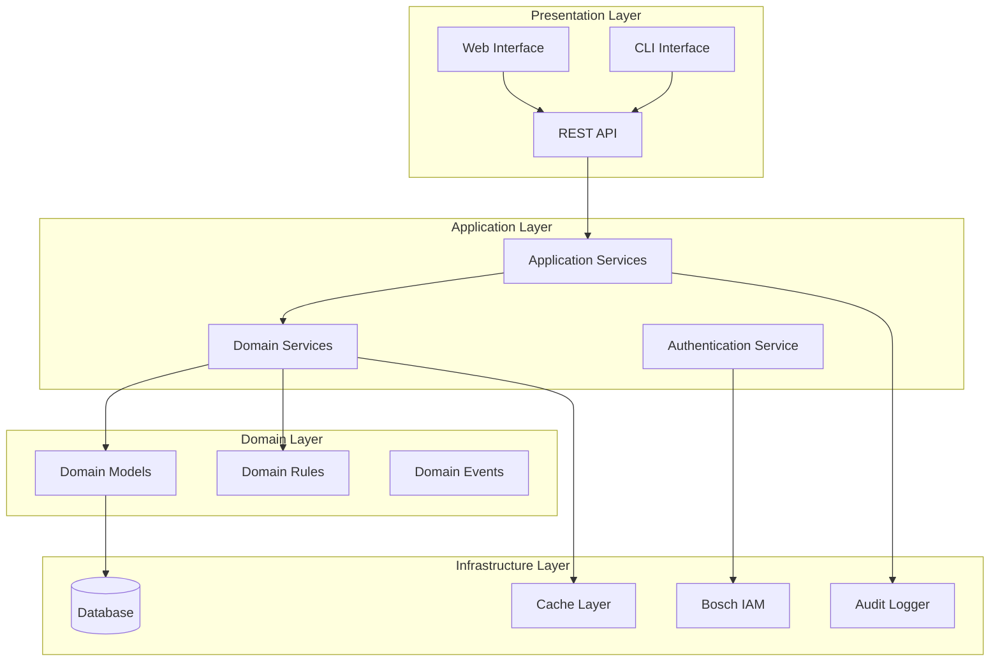
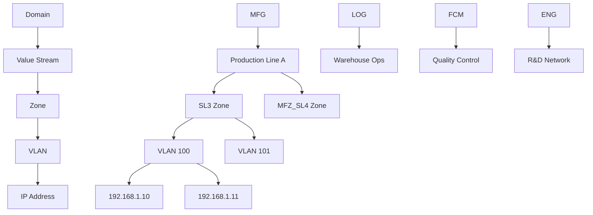

# Design Document: IP Management & VLAN Segmentation System

## Overview

The IP Management & VLAN Segmentation System is a Python-based enterprise network management platform designed for industrial production environments. The system provides hierarchical organization of network resources, automated IP allocation with reserved management ranges, and comprehensive VLAN management capabilities. The architecture follows domain-driven design principles with clear separation between business logic, data persistence, and user interfaces.

The system targets IT/OT network convergence scenarios, initially deployed at Bursa Bosch Rexroth Factory, with scalability for multi-plant enterprise deployments. The design emphasizes security, auditability, and integration with existing enterprise authentication systems.

## Architecture

### High-Level Architecture



### Domain Architecture

The system implements a five-tier hierarchical domain model:



## Components and Interfaces

### Core Domain Models

#### Hierarchical Entities

```python
# Domain Entity Base
class Entity:
    def __init__(self, id: UUID):
        self.id = id
        self.created_at = datetime.utcnow()
        self.updated_at = datetime.utcnow()

# Domain Aggregate Root
class Domain(Entity):
    def __init__(self, id: UUID, name: DomainType, description: str):
        super().__init__(id)
        self.name = name  # MFG, LOG, FCM, ENG
        self.description = description
        self.value_streams: List[ValueStream] = []
        self.policies: DomainPolicies = DomainPolicies()

class ValueStream(Entity):
    def __init__(self, id: UUID, name: str, domain_id: UUID):
        super().__init__(id)
        self.name = name
        self.domain_id = domain_id
        self.zones: List[Zone] = []

class Zone(Entity):
    def __init__(self, id: UUID, name: str, security_level: SecurityLevel, 
                 value_stream_id: UUID, manager: str):
        super().__init__(id)
        self.name = name
        self.security_level = security_level
        self.value_stream_id = value_stream_id
        self.manager = manager
        self.vlans: List[VLAN] = []
```

#### Network Configuration Models

```python
class VLAN(Entity):
    def __init__(self, id: UUID, vlan_id: int, subnet: IPv4Network, 
                 zone_id: UUID, default_gateway: IPv4Address):
        super().__init__(id)
        self.vlan_id = vlan_id
        self.subnet = subnet
        self.zone_id = zone_id
        self.default_gateway = default_gateway
        self.network_start = subnet.network_address + 7  # Skip first 6 + network
        self.network_end = subnet.broadcast_address - 1  # Skip broadcast
        self.last_firewall_check = None
        self.ip_allocations: List[IPAllocation] = []
        
    def get_available_ips(self) -> List[IPv4Address]:
        """Returns list of available IP addresses excluding reserved ranges"""
        allocated_ips = {alloc.ip_address for alloc in self.ip_allocations}
        available = []
        
        for ip in self.subnet.hosts():
            if (ip >= self.network_start and ip <= self.network_end and 
                ip not in allocated_ips):
                available.append(ip)
        
        return available

class IPAllocation(Entity):
    def __init__(self, id: UUID, vlan_id: UUID, ci_name: str, 
                 mac_address: str, ip_address: IPv4Address, description: str):
        super().__init__(id)
        self.vlan_id = vlan_id
        self.ci_name = ci_name
        self.mac_address = mac_address
        self.ip_address = ip_address
        self.description = description
        self.allocation_type = AllocationTypeEnum.MANUAL
```

### Domain Services

#### IP Management Service

```python
class IPManagementService:
    def __init__(self, ip_repo: IPAllocationRepository, 
                 vlan_repo: VLANRepository, audit_service: AuditService):
        self.ip_repo = ip_repo
        self.vlan_repo = vlan_repo
        self.audit_service = audit_service
    
    def allocate_ip_automatically(self, vlan_id: UUID, ci_name: str, 
                                 mac_address: str, description: str) -> IPAllocation:
        """Automatically allocate next available IP in VLAN"""
        vlan = self.vlan_repo.get_by_id(vlan_id)
        if not vlan:
            raise VLANNotFoundException(vlan_id)
        
        # Validate MAC address format
        if not self._is_valid_mac(mac_address):
            raise InvalidMACAddressException(mac_address)
        
        # Check for duplicate MAC across system
        if self.ip_repo.exists_by_mac(mac_address):
            raise DuplicateMACAddressException(mac_address)
        
        available_ips = vlan.get_available_ips()
        if not available_ips:
            raise NoAvailableIPsException(vlan_id)
        
        # Allocate first available IP
        ip_address = available_ips[0]
        allocation = IPAllocation(
            id=uuid4(),
            vlan_id=vlan_id,
            ci_name=ci_name,
            mac_address=mac_address,
            ip_address=ip_address,
            description=description
        )
        allocation.allocation_type = AllocationTypeEnum.AUTOMATIC
        
        self.ip_repo.save(allocation)
        self.audit_service.log_ip_allocation(allocation, "AUTOMATIC_ALLOCATION")
        
        return allocation
    
    def allocate_ip_manually(self, vlan_id: UUID, ci_name: str, 
                           mac_address: str, ip_address: IPv4Address, 
                           description: str) -> IPAllocation:
        """Manually allocate specific IP address"""
        vlan = self.vlan_repo.get_by_id(vlan_id)
        if not vlan:
            raise VLANNotFoundException(vlan_id)
        
        # Validate IP is within VLAN subnet
        if ip_address not in vlan.subnet:
            raise IPNotInSubnetException(ip_address, vlan.subnet)
        
        # Check if IP is in reserved range
        if self._is_reserved_ip(ip_address, vlan):
            raise ReservedIPException(ip_address)
        
        # Check for duplicate IP in VLAN
        if self.ip_repo.exists_by_ip_in_vlan(ip_address, vlan_id):
            raise DuplicateIPException(ip_address, vlan_id)
        
        # Validate MAC address and check for duplicates
        if not self._is_valid_mac(mac_address):
            raise InvalidMACAddressException(mac_address)
        
        if self.ip_repo.exists_by_mac(mac_address):
            raise DuplicateMACAddressException(mac_address)
        
        allocation = IPAllocation(
            id=uuid4(),
            vlan_id=vlan_id,
            ci_name=ci_name,
            mac_address=mac_address,
            ip_address=ip_address,
            description=description
        )
        allocation.allocation_type = AllocationTypeEnum.MANUAL
        
        self.ip_repo.save(allocation)
        self.audit_service.log_ip_allocation(allocation, "MANUAL_ALLOCATION")
        
        return allocation
```

#### VLAN Management Service

```python
class VLANManagementService:
    def __init__(self, vlan_repo: VLANRepository, zone_repo: ZoneRepository,
                 ip_repo: IPAllocationRepository, audit_service: AuditService):
        self.vlan_repo = vlan_repo
        self.zone_repo = zone_repo
        self.ip_repo = ip_repo
        self.audit_service = audit_service
    
    def create_vlan(self, vlan_id: int, subnet_cidr: str, zone_id: UUID,
                   default_gateway: str) -> VLAN:
        """Create new VLAN with validation"""
        zone = self.zone_repo.get_by_id(zone_id)
        if not zone:
            raise ZoneNotFoundException(zone_id)
        
        # Validate VLAN ID uniqueness within domain
        domain_id = self._get_domain_id_for_zone(zone_id)
        if self.vlan_repo.exists_vlan_id_in_domain(vlan_id, domain_id):
            raise DuplicateVLANIDException(vlan_id, domain_id)
        
        # Parse and validate subnet
        try:
            subnet = IPv4Network(subnet_cidr, strict=True)
            gateway = IPv4Address(default_gateway)
        except ValueError as e:
            raise InvalidSubnetException(subnet_cidr, str(e))
        
        # Validate gateway is within subnet
        if gateway not in subnet:
            raise GatewayNotInSubnetException(gateway, subnet)
        
        # Check for subnet overlaps in same security zone
        overlapping_vlans = self.vlan_repo.find_overlapping_subnets(subnet, zone.security_level)
        if overlapping_vlans:
            raise SubnetOverlapException(subnet, overlapping_vlans)
        
        vlan = VLAN(
            id=uuid4(),
            vlan_id=vlan_id,
            subnet=subnet,
            zone_id=zone_id,
            default_gateway=gateway
        )
        
        self.vlan_repo.save(vlan)
        self.audit_service.log_vlan_creation(vlan)
        
        return vlan
    
    def auto_generate_vlan_config(self, zone_id: UUID, device_count: int,
                                 growth_factor: float = 1.5) -> VLANConfig:
        """Auto-generate optimal VLAN configuration based on requirements"""
        zone = self.zone_repo.get_by_id(zone_id)
        if not zone:
            raise ZoneNotFoundException(zone_id)
        
        # Calculate required IP addresses (devices + reserved + growth)
        reserved_ips = 7  # First 6 + broadcast
        required_ips = int(device_count * growth_factor) + reserved_ips
        
        # Find smallest subnet that accommodates requirements
        subnet_size = self._calculate_optimal_subnet_size(required_ips)
        
        # Suggest available VLAN ID
        domain_id = self._get_domain_id_for_zone(zone_id)
        suggested_vlan_id = self._suggest_vlan_id(domain_id)
        
        # Generate subnet suggestion based on zone security level
        suggested_subnet = self._suggest_subnet(zone.security_level, subnet_size)
        
        return VLANConfig(
            suggested_vlan_id=suggested_vlan_id,
            suggested_subnet=suggested_subnet,
            device_capacity=subnet_size - reserved_ips,
            reserved_range_start=suggested_subnet.network_address,
            reserved_range_end=suggested_subnet.network_address + 6,
            available_range_start=suggested_subnet.network_address + 7,
            available_range_end=suggested_subnet.broadcast_address - 1
        )
```

### Application Services

#### Hierarchy Management Service

```python
class HierarchyManagementService:
    def __init__(self, domain_repo: DomainRepository, 
                 value_stream_repo: ValueStreamRepository,
                 zone_repo: ZoneRepository, vlan_repo: VLANRepository):
        self.domain_repo = domain_repo
        self.value_stream_repo = value_stream_repo
        self.zone_repo = zone_repo
        self.vlan_repo = vlan_repo
    
    def get_hierarchy_tree(self, domain_name: Optional[str] = None) -> HierarchyTree:
        """Get complete or filtered hierarchy tree"""
        if domain_name:
            domains = [self.domain_repo.get_by_name(domain_name)]
        else:
            domains = self.domain_repo.get_all()
        
        tree = HierarchyTree()
        for domain in domains:
            domain_node = tree.add_domain(domain)
            
            value_streams = self.value_stream_repo.get_by_domain_id(domain.id)
            for vs in value_streams:
                vs_node = domain_node.add_value_stream(vs)
                
                zones = self.zone_repo.get_by_value_stream_id(vs.id)
                for zone in zones:
                    zone_node = vs_node.add_zone(zone)
                    
                    vlans = self.vlan_repo.get_by_zone_id(zone.id)
                    for vlan in vlans:
                        zone_node.add_vlan(vlan)
        
        return tree
    
    def delete_with_referential_integrity(self, entity_type: str, 
                                        entity_id: UUID) -> None:
        """Delete entity with referential integrity checks"""
        if entity_type == "domain":
            value_streams = self.value_stream_repo.get_by_domain_id(entity_id)
            if value_streams:
                raise ReferentialIntegrityException(
                    f"Cannot delete domain: {len(value_streams)} value streams exist"
                )
            self.domain_repo.delete(entity_id)
            
        elif entity_type == "value_stream":
            zones = self.zone_repo.get_by_value_stream_id(entity_id)
            if zones:
                raise ReferentialIntegrityException(
                    f"Cannot delete value stream: {len(zones)} zones exist"
                )
            self.value_stream_repo.delete(entity_id)
            
        elif entity_type == "zone":
            vlans = self.vlan_repo.get_by_zone_id(entity_id)
            if vlans:
                raise ReferentialIntegrityException(
                    f"Cannot delete zone: {len(vlans)} VLANs exist"
                )
            self.zone_repo.delete(entity_id)
```

## Data Models

### Database Schema

```sql
-- Domains table
CREATE TABLE domains (
    id UUID PRIMARY KEY DEFAULT gen_random_uuid(),
    name VARCHAR(10) NOT NULL CHECK (name IN ('MFG', 'LOG', 'FCM', 'ENG')),
    description TEXT,
    created_at TIMESTAMP WITH TIME ZONE DEFAULT NOW(),
    updated_at TIMESTAMP WITH TIME ZONE DEFAULT NOW(),
    UNIQUE(name)
);

-- Value Streams table
CREATE TABLE value_streams (
    id UUID PRIMARY KEY DEFAULT gen_random_uuid(),
    name VARCHAR(255) NOT NULL,
    domain_id UUID NOT NULL REFERENCES domains(id) ON DELETE CASCADE,
    description TEXT,
    created_at TIMESTAMP WITH TIME ZONE DEFAULT NOW(),
    updated_at TIMESTAMP WITH TIME ZONE DEFAULT NOW(),
    UNIQUE(name, domain_id)
);

-- Zones table
CREATE TABLE zones (
    id UUID PRIMARY KEY DEFAULT gen_random_uuid(),
    name VARCHAR(255) NOT NULL,
    security_level VARCHAR(20) NOT NULL CHECK (
        security_level IN ('SL3', 'MFZ_SL4', 'LOG_SL4', 'FMZ_SL4', 
                          'ENG_SL4', 'LRSZ_SL4', 'RSZ_SL4')
    ),
    value_stream_id UUID NOT NULL REFERENCES value_streams(id) ON DELETE CASCADE,
    manager VARCHAR(255) NOT NULL,
    created_at TIMESTAMP WITH TIME ZONE DEFAULT NOW(),
    updated_at TIMESTAMP WITH TIME ZONE DEFAULT NOW(),
    UNIQUE(name, value_stream_id)
);

-- VLANs table
CREATE TABLE vlans (
    id UUID PRIMARY KEY DEFAULT gen_random_uuid(),
    vlan_id INTEGER NOT NULL CHECK (vlan_id >= 1 AND vlan_id <= 4094),
    subnet CIDR NOT NULL,
    subnet_mask INTEGER NOT NULL CHECK (subnet_mask >= 8 AND subnet_mask <= 30),
    default_gateway INET NOT NULL,
    network_start INET NOT NULL,
    network_end INET NOT NULL,
    zone_id UUID NOT NULL REFERENCES zones(id) ON DELETE CASCADE,
    last_firewall_check TIMESTAMP WITH TIME ZONE,
    created_at TIMESTAMP WITH TIME ZONE DEFAULT NOW(),
    updated_at TIMESTAMP WITH TIME ZONE DEFAULT NOW()
);

-- IP Allocations table
CREATE TABLE ip_allocations (
    id UUID PRIMARY KEY DEFAULT gen_random_uuid(),
    vlan_id UUID NOT NULL REFERENCES vlans(id) ON DELETE CASCADE,
    ci_name VARCHAR(255) NOT NULL,
    mac_address MACADDR NOT NULL,
    ip_address INET NOT NULL,
    description TEXT,
    allocation_type VARCHAR(20) NOT NULL DEFAULT 'MANUAL' 
        CHECK (allocation_type IN ('MANUAL', 'AUTOMATIC')),
    created_at TIMESTAMP WITH TIME ZONE DEFAULT NOW(),
    updated_at TIMESTAMP WITH TIME ZONE DEFAULT NOW(),
    UNIQUE(mac_address),
    UNIQUE(ip_address, vlan_id)
);

-- Audit Log table
CREATE TABLE audit_logs (
    id UUID PRIMARY KEY DEFAULT gen_random_uuid(),
    entity_type VARCHAR(50) NOT NULL,
    entity_id UUID NOT NULL,
    action VARCHAR(50) NOT NULL,
    user_id VARCHAR(255) NOT NULL,
    changes JSONB,
    timestamp TIMESTAMP WITH TIME ZONE DEFAULT NOW()
);

-- Indexes for performance
CREATE INDEX idx_vlans_zone_id ON vlans(zone_id);
CREATE INDEX idx_vlans_vlan_id ON vlans(vlan_id);
CREATE INDEX idx_ip_allocations_vlan_id ON ip_allocations(vlan_id);
CREATE INDEX idx_ip_allocations_mac_address ON ip_allocations(mac_address);
CREATE INDEX idx_ip_allocations_ip_address ON ip_allocations(ip_address);
CREATE INDEX idx_audit_logs_entity ON audit_logs(entity_type, entity_id);
CREATE INDEX idx_audit_logs_timestamp ON audit_logs(timestamp);

-- Constraints for VLAN ID uniqueness within domain
CREATE UNIQUE INDEX idx_vlan_id_domain_unique ON vlans(vlan_id, 
    (SELECT domain_id FROM value_streams vs 
     JOIN zones z ON vs.id = z.value_stream_id 
     WHERE z.id = vlans.zone_id));
```

### Repository Interfaces

```python
class IPAllocationRepository(ABC):
    @abstractmethod
    def save(self, allocation: IPAllocation) -> None: ...
    
    @abstractmethod
    def get_by_id(self, id: UUID) -> Optional[IPAllocation]: ...
    
    @abstractmethod
    def get_by_vlan_id(self, vlan_id: UUID) -> List[IPAllocation]: ...
    
    @abstractmethod
    def exists_by_mac(self, mac_address: str) -> bool: ...
    
    @abstractmethod
    def exists_by_ip_in_vlan(self, ip_address: IPv4Address, vlan_id: UUID) -> bool: ...
    
    @abstractmethod
    def delete(self, id: UUID) -> None: ...
    
    @abstractmethod
    def get_allocation_history(self, vlan_id: UUID) -> List[AllocationHistory]: ...

class VLANRepository(ABC):
    @abstractmethod
    def save(self, vlan: VLAN) -> None: ...
    
    @abstractmethod
    def get_by_id(self, id: UUID) -> Optional[VLAN]: ...
    
    @abstractmethod
    def get_by_zone_id(self, zone_id: UUID) -> List[VLAN]: ...
    
    @abstractmethod
    def exists_vlan_id_in_domain(self, vlan_id: int, domain_id: UUID) -> bool: ...
    
    @abstractmethod
    def find_overlapping_subnets(self, subnet: IPv4Network, 
                                security_level: SecurityLevel) -> List[VLAN]: ...
    
    @abstractmethod
    def delete(self, id: UUID) -> None: ...
```

## Correctness Properties

*A property is a characteristic or behavior that should hold true across all valid executions of a system—essentially, a formal statement about what the system should do. Properties serve as the bridge between human-readable specifications and machine-verifiable correctness guarantees.*

Based on the prework analysis, the following properties capture the essential correctness requirements:

### Property 1: Hierarchical Structure Integrity
*For any* valid system entity, it must follow the exact five-tier hierarchy: Domain → Value Stream → Zone → VLAN → IP, and no entity can exist without its proper parent in the hierarchy.
**Validates: Requirements 1.1, 1.3, 10.5**

### Property 2: Navigation Consistency
*For any* parent entity in the hierarchy, all returned child entities must actually belong to that parent and no orphaned entities should be accessible.
**Validates: Requirements 1.2**

### Property 3: Referential Integrity Protection
*For any* parent entity with child entities, deletion attempts must be prevented, and this rule must apply consistently across all hierarchy levels.
**Validates: Requirements 1.4, 5.3, 6.4**

### Property 4: Domain Value Constraints
*For any* domain creation or validation operation, only the exact values MFG, LOG, FCM, ENG must be accepted, and all other values must be rejected.
**Validates: Requirements 1.5, 5.1**

### Property 5: VLAN Creation Validation
*For any* VLAN creation request, all required fields (VLAN ID, subnet, subnet mask, default gateway, network start, network end, zone name, zone manager) must be present and valid.
**Validates: Requirements 2.1**

### Property 6: VLAN ID Domain Uniqueness
*For any* VLAN within a domain, the VLAN ID must be unique within that domain scope, and duplicate VLAN IDs within the same domain must be rejected.
**Validates: Requirements 2.2**

### Property 7: Subnet Mathematical Correctness
*For any* subnet configuration, the subnet, mask, gateway, and boundary calculations must be mathematically correct according to CIDR standards.
**Validates: Requirements 2.3, 2.5**

### Property 8: Security Zone Subnet Isolation
*For any* two VLANs within the same security zone, their subnets must not overlap, and overlapping subnet assignments must be prevented.
**Validates: Requirements 2.6**

### Property 9: Reserved IP Protection
*For any* IP allocation (automatic or manual), the first 6 IP addresses and the last IP address in any subnet must never be allocated, and allocation attempts for these addresses must be rejected.
**Validates: Requirements 3.1, 3.2, 3.5, 8.2**

### Property 10: IP Allocation Range Compliance
*For any* IP allocation, the allocated IP address must fall within the available range between reserved blocks and within the VLAN subnet boundaries.
**Validates: Requirements 3.3, 4.3**

### Property 11: IP Pool Exhaustion Handling
*For any* VLAN where all available IPs are allocated, further allocation attempts must be rejected with appropriate error notification.
**Validates: Requirements 3.4**

### Property 12: MAC Address Format and Uniqueness
*For any* MAC address in the system, it must follow valid MAC address format and be globally unique across all IP allocations.
**Validates: Requirements 4.2, 4.5**

### Property 13: IP Address VLAN Uniqueness
*For any* IP address within a VLAN, it must be unique within that VLAN, and duplicate IP assignments within the same VLAN must be prevented.
**Validates: Requirements 4.4**

### Property 14: Data Persistence Consistency
*For any* save operation, the data must be successfully persisted to the database and remain accessible for subsequent operations.
**Validates: Requirements 4.6, 10.1**

### Property 15: Security Level Constraints
*For any* zone creation or validation, only the predefined security levels (SL3, MFZ_SL4, LOG_SL4, FMZ_SL4, ENG_SL4, LRSZ_SL4, RSZ_SL4) must be accepted.
**Validates: Requirements 7.1, 7.2**

### Property 16: Comprehensive Audit Logging
*For any* data modification operation (IP allocation, VLAN creation, zone changes, authentication events), a complete audit log entry must be created with timestamp and user attribution.
**Validates: Requirements 3.6, 7.6, 8.5, 10.6, 11.5**

### Property 17: Transaction Atomicity
*For any* multi-table database operation, either all changes must be committed successfully or all changes must be rolled back, maintaining database consistency.
**Validates: Requirements 10.2**

### Property 18: Auto-Generation Calculation Accuracy
*For any* auto-generation request with device count requirements, the calculated VLAN configuration must accommodate the specified device count plus reserved IP ranges with appropriate growth factor.
**Validates: Requirements 9.1, 9.3, 9.4**

### Property 19: Configuration Preview Consistency
*For any* auto-generated configuration, the preview must exactly match what would be applied when the configuration is actually created.
**Validates: Requirements 9.5**

### Property 20: Authentication Integration
*For any* user authentication attempt, the system must properly integrate with Bosch IAM and enforce role-based access control according to user permissions.
**Validates: Requirements 11.1, 11.2**

### Property 21: Multi-Tenant Data Isolation
*For any* multi-plant deployment, tenant data must be completely isolated, and no tenant should be able to access another tenant's data.
**Validates: Requirements 12.1, 12.3**

<function_calls>
<invoke name="prework">
<parameter name="featureName">ip-vlan-management

## Error Handling

### Exception Hierarchy

```python
class IPManagementException(Exception):
    """Base exception for IP Management system"""
    pass

class ValidationException(IPManagementException):
    """Base class for validation errors"""
    pass

class BusinessRuleException(IPManagementException):
    """Base class for business rule violations"""
    pass

# Network-specific exceptions
class InvalidSubnetException(ValidationException):
    def __init__(self, subnet: str, reason: str):
        super().__init__(f"Invalid subnet '{subnet}': {reason}")

class SubnetOverlapException(BusinessRuleException):
    def __init__(self, subnet: IPv4Network, overlapping_vlans: List[VLAN]):
        vlan_ids = [str(v.vlan_id) for v in overlapping_vlans]
        super().__init__(f"Subnet {subnet} overlaps with VLANs: {', '.join(vlan_ids)}")

class ReservedIPException(BusinessRuleException):
    def __init__(self, ip_address: IPv4Address):
        super().__init__(f"IP address {ip_address} is in reserved range")

class NoAvailableIPsException(BusinessRuleException):
    def __init__(self, vlan_id: UUID):
        super().__init__(f"No available IP addresses in VLAN {vlan_id}")

# Referential integrity exceptions
class ReferentialIntegrityException(BusinessRuleException):
    pass

class VLANNotFoundException(IPManagementException):
    def __init__(self, vlan_id: UUID):
        super().__init__(f"VLAN not found: {vlan_id}")

# Duplicate resource exceptions
class DuplicateVLANIDException(BusinessRuleException):
    def __init__(self, vlan_id: int, domain_id: UUID):
        super().__init__(f"VLAN ID {vlan_id} already exists in domain {domain_id}")

class DuplicateIPException(BusinessRuleException):
    def __init__(self, ip_address: IPv4Address, vlan_id: UUID):
        super().__init__(f"IP address {ip_address} already allocated in VLAN {vlan_id}")

class DuplicateMACAddressException(BusinessRuleException):
    def __init__(self, mac_address: str):
        super().__init__(f"MAC address {mac_address} already registered")
```

### Error Handling Strategy

1. **Input Validation**: All user inputs are validated at the service layer before processing
2. **Business Rule Enforcement**: Domain services enforce business rules and throw appropriate exceptions
3. **Transaction Rollback**: Database transactions are rolled back on any error to maintain consistency
4. **Audit Logging**: All errors are logged with context for troubleshooting
5. **User-Friendly Messages**: API layer translates technical exceptions to user-friendly error messages
6. **Graceful Degradation**: System continues operating even when non-critical components fail

### Error Response Format

```python
@dataclass
class ErrorResponse:
    error_code: str
    message: str
    details: Optional[Dict[str, Any]] = None
    timestamp: datetime = field(default_factory=datetime.utcnow)
    request_id: Optional[str] = None

# Example error responses
{
    "error_code": "SUBNET_OVERLAP",
    "message": "The specified subnet overlaps with existing VLANs",
    "details": {
        "requested_subnet": "192.168.1.0/24",
        "conflicting_vlans": [100, 101]
    },
    "timestamp": "2024-01-15T10:30:00Z",
    "request_id": "req_123456"
}
```

## Testing Strategy

### Dual Testing Approach

The system employs both unit testing and property-based testing to ensure comprehensive coverage:

- **Unit tests**: Verify specific examples, edge cases, and error conditions
- **Property tests**: Verify universal properties across all inputs
- Both approaches are complementary and necessary for comprehensive coverage

### Property-Based Testing Configuration

- **Testing Library**: Hypothesis (Python property-based testing library)
- **Test Iterations**: Minimum 100 iterations per property test
- **Test Tagging**: Each property test references its design document property
- **Tag Format**: `# Feature: ip-vlan-management, Property {number}: {property_text}`

### Unit Testing Strategy

Unit tests focus on:
- **Specific Examples**: Concrete scenarios that demonstrate correct behavior
- **Edge Cases**: Boundary conditions, empty inputs, maximum values
- **Error Conditions**: Invalid inputs, constraint violations, system failures
- **Integration Points**: Component interactions and data flow validation

### Property Testing Strategy

Property tests focus on:
- **Universal Properties**: Rules that must hold for all valid inputs
- **Invariant Preservation**: Properties that remain constant across operations
- **Round-trip Properties**: Operations that should be reversible
- **Metamorphic Properties**: Relationships between different inputs/outputs

### Test Organization

```
tests/
├── unit/
│   ├── test_domain_models.py
│   ├── test_ip_management_service.py
│   ├── test_vlan_management_service.py
│   └── test_hierarchy_service.py
├── property/
│   ├── test_hierarchy_properties.py
│   ├── test_ip_allocation_properties.py
│   ├── test_vlan_properties.py
│   └── test_security_properties.py
├── integration/
│   ├── test_database_integration.py
│   ├── test_api_endpoints.py
│   └── test_authentication_integration.py
└── fixtures/
    ├── domain_fixtures.py
    ├── network_fixtures.py
    └── test_data.py
```

### Example Property Test Implementation

```python
from hypothesis import given, strategies as st
import pytest

class TestHierarchyProperties:
    
    @given(st.text(min_size=1, max_size=100))
    def test_property_1_hierarchical_structure_integrity(self, entity_name):
        """
        Feature: ip-vlan-management, Property 1: Hierarchical Structure Integrity
        For any valid system entity, it must follow the exact five-tier hierarchy
        """
        # Test implementation here
        pass
    
    @given(st.uuids(), st.lists(st.uuids(), min_size=0, max_size=10))
    def test_property_2_navigation_consistency(self, parent_id, child_ids):
        """
        Feature: ip-vlan-management, Property 2: Navigation Consistency
        For any parent entity, all returned children must belong to that parent
        """
        # Test implementation here
        pass
```

### Coverage Requirements

- **Minimum Coverage**: 80% code coverage for core business logic
- **Property Coverage**: Each correctness property must have corresponding property test
- **Integration Coverage**: All major component interactions must be tested
- **Error Path Coverage**: All exception paths must be tested

### Continuous Integration

- **Automated Testing**: All tests run on every commit
- **Performance Benchmarks**: Property tests include performance assertions
- **Security Testing**: Authentication and authorization paths are tested
- **Database Testing**: Tests run against real database instances
- **Multi-Environment Testing**: Tests run against different Python versions and database configurations

The testing strategy ensures that the IP Management & VLAN Segmentation System maintains high reliability and correctness standards while supporting rapid development and deployment cycles.