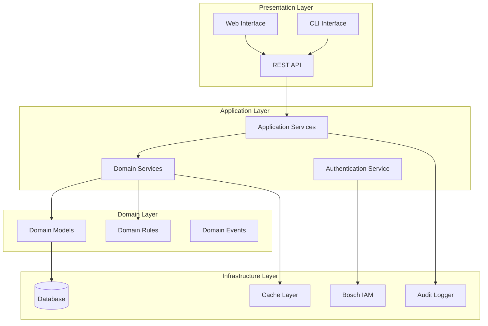
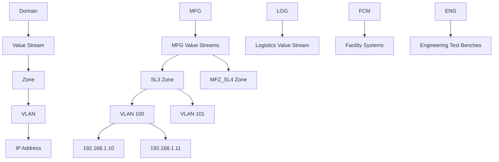

# Design Document: IP Management & VLAN Segmentation System

## Overview

The IP Management & VLAN Segmentation System is a Python-based enterprise network management platform designed for industrial production environments. The system provides hierarchical organization of network resources, automated IP allocation with reserved management ranges, and comprehensive VLAN management capabilities. The architecture follows domain-driven design principles with clear separation between business logic, data persistence, and user interfaces.

The system targets IT/OT network convergence scenarios, initially deployed at Bursa Bosch Rexroth Factory, with scalability for multi-plant enterprise deployments. The design emphasizes security, auditability, and integration with existing enterprise authentication systems.

## Architecture

### High-Level Architecture



### Domain Architecture

The system implements a five-tier hierarchical domain model:



## Components and Interfaces

### Core Domain Models

#### Hierarchical Entities

```python
# Domain Entity Base
class Entity:
    def __init__(self, id: UUID):
        self.id = id
        self.created_at = datetime.utcnow()
        self.updated_at = datetime.utcnow()

# Domain Aggregate Root
class Domain(Entity):
    def __init__(self, id: UUID, name: DomainType, description: str):
        super().__init__(id)
        self.name = name  # MFG, LOG, FCM, ENG
        self.description = description
        self.value_streams: List[ValueStream] = []
        self.policies: DomainPolicies = DomainPolicies()

class ValueStream(Entity):
    def __init__(self, id: UUID, name: str, domain_id: UUID):
        super().__init__(id)
        self.name = name
        self.domain_id = domain_id
        self.zones: List[Zone] = []

class Zone(Entity):
    def __init__(self, id: UUID, name: str, security_level: SecurityLevel, 
                 value_stream_id: UUID, manager: str):
        super().__init__(id)
        self.name = name
        self.security_level = security_level
        self.value_stream_id = value_stream_id
        self.manager = manager
        self.vlans: List[VLAN] = []
```

#### Network Configuration Models

```python
class VLAN(Entity):
    def __init__(self, id: UUID, vlan_id: int, subnet: IPv4Network, 
                 zone_id: UUID, default_gateway: IPv4Address):
        super().__init__(id)
        self.vlan_id = vlan_id
        self.subnet = subnet
        self.zone_id = zone_id
        self.default_gateway = default_gateway
        self.network_start = subnet.network_address + 7  # Skip first 6 + network
        self.network_end = subnet.broadcast_address - 1  # Skip broadcast
        self.last_firewall_check = None
        self.ip_allocations: List[IPAllocation] = []
        
    def get_available_ips(self) -> List[IPv4Address]:
        """Returns list of available IP addresses excluding reserved ranges"""
        allocated_ips = {alloc.ip_address for alloc in self.ip_allocations}
        available = []
        
        for ip in self.subnet.hosts():
            if (ip >= self.network_start and ip <= self.network_end and 
                ip not in allocated_ips):
                available.append(ip)
        
        return available

class IPAllocation(Entity):
    def __init__(self, id: UUID, vlan_id: UUID, ci_name: str, 
                 mac_address: str, ip_address: IPv4Address, description: str):
        super().__init__(id)
        self.vlan_id = vlan_id
        self.ci_name = ci_name
        self.mac_address = mac_address
        self.ip_address = ip_address
        self.description = description
        self.allocation_type = AllocationTypeEnum.MANUAL
```

### Domain Services

#### IP Management Service

```python
class IPManagementService:
    def __init__(self, ip_repo: IPAllocationRepository, 
                 vlan_repo: VLANRepository, audit_service: AuditService):
        self.ip_repo = ip_repo
        self.vlan_repo = vlan_repo
        self.audit_service = audit_service
    
    def allocate_ip_automatically(self, vlan_id: UUID, ci_name: str, 
                                 mac_address: str, description: str) -> IPAllocation:
        """Automatically allocate next available IP in VLAN"""
        vlan = self.vlan_repo.get_by_id(vlan_id)
        if not vlan:
            raise VLANNotFoundException(vlan_id)
        
        # Validate MAC address format
        if not self._is_valid_mac(mac_address):
            raise InvalidMACAddressException(mac_address)
        
        # Check for duplicate MAC across system
        if self.ip_repo.exists_by_mac(mac_address):
            raise DuplicateMACAddressException(mac_address)
        
        available_ips = vlan.get_available_ips()
        if not available_ips:
            raise NoAvailableIPsException(vlan_id)
        
        # Allocate first available IP
        ip_address = available_ips[0]
        allocation = IPAllocation(
            id=uuid4(),
            vlan_id=vlan_id,
            ci_name=ci_name,
            mac_address=mac_address,
            ip_address=ip_address,
            description=description
        )
        allocation.allocation_type = AllocationTypeEnum.AUTOMATIC
        
        self.ip_repo.save(allocation)
        self.audit_service.log_ip_allocation(allocation, "AUTOMATIC_ALLOCATION")
        
        return allocation
    
    def allocate_ip_manually(self, vlan_id: UUID, ci_name: str, 
                           mac_address: str, ip_address: IPv4Address, 
                           description: str) -> IPAllocation:
        """Manually allocate specific IP address"""
        vlan = self.vlan_repo.get_by_id(vlan_id)
        if not vlan:
            raise VLANNotFoundException(vlan_id)
        
        # Validate IP is within VLAN subnet
        if ip_address not in vlan.subnet:
            raise IPNotInSubnetException(ip_address, vlan.subnet)
        
        # Check if IP is in reserved range
        if self._is_reserved_ip(ip_address, vlan):
            raise ReservedIPException(ip_address)
        
        # Check for duplicate IP in VLAN
        if self.ip_repo.exists_by_ip_in_vlan(ip_address, vlan_id):
            raise DuplicateIPException(ip_address, vlan_id)
        
        # Validate MAC address and check for duplicates
        if not self._is_valid_mac(mac_address):
            raise InvalidMACAddressException(mac_address)
        
        if self.ip_repo.exists_by_mac(mac_address):
            raise DuplicateMACAddressException(mac_address)
        
        allocation = IPAllocation(
            id=uuid4(),
            vlan_id=vlan_id,
            ci_name=ci_name,
            mac_address=mac_address,
            ip_address=ip_address,
            description=description
        )
        allocation.allocation_type = AllocationTypeEnum.MANUAL
        
        self.ip_repo.save(allocation)
        self.audit_service.log_ip_allocation(allocation, "MANUAL_ALLOCATION")
        
        return allocation
```

#### VLAN Management Service

```python
class VLANManagementService:
    def __init__(self, vlan_repo: VLANRepository, zone_repo: ZoneRepository,
                 ip_repo: IPAllocationRepository, audit_service: AuditService):
        self.vlan_repo = vlan_repo
        self.zone_repo = zone_repo
        self.ip_repo = ip_repo
        self.audit_service = audit_service
    
    def create_vlan(self, vlan_id: int, subnet_cidr: str, zone_id: UUID,
                   default_gateway: str) -> VLAN:
        """Create new VLAN with validation"""
        zone = self.zone_repo.get_by_id(zone_id)
        if not zone:
            raise ZoneNotFoundException(zone_id)
        
        # Validate VLAN ID uniqueness within domain
        domain_id = self._get_domain_id_for_zone(zone_id)
        if self.vlan_repo.exists_vlan_id_in_domain(vlan_id, domain_id):
            raise DuplicateVLANIDException(vlan_id, domain_id)
        
        # Parse and validate subnet
        try:
            subnet = IPv4Network(subnet_cidr, strict=True)
            gateway = IPv4Address(default_gateway)
        except ValueError as e:
            raise InvalidSubnetException(subnet_cidr, str(e))
        
        # Validate gateway is within subnet
        if gateway not in subnet:
            raise GatewayNotInSubnetException(gateway, subnet)
        
        # Check for subnet overlaps in same security zone
        overlapping_vlans = self.vlan_repo.find_overlapping_subnets(subnet, zone.security_level)
        if overlapping_vlans:
            raise SubnetOverlapException(subnet, overlapping_vlans)
        
        vlan = VLAN(
            id=uuid4(),
            vlan_id=vlan_id,
            subnet=subnet,
            zone_id=zone_id,
            default_gateway=gateway
        )
        
        self.vlan_repo.save(vlan)
        self.audit_service.log_vlan_creation(vlan)
        
        return vlan
    
    def auto_generate_vlan_config(self, zone_id: UUID, device_count: int,
                                 growth_factor: float = 1.5) -> VLANConfig:
        """Auto-generate optimal VLAN configuration based on requirements"""
        zone = self.zone_repo.get_by_id(zone_id)
        if not zone:
            raise ZoneNotFoundException(zone_id)
        
        # Calculate required IP addresses (devices + reserved + growth)
        reserved_ips = 7  # First 6 + broadcast
        required_ips = int(device_count * growth_factor) + reserved_ips
        
        # Find smallest subnet that accommodates requirements
        subnet_size = self._calculate_optimal_subnet_size(required_ips)
        
        # Suggest available VLAN ID
        domain_id = self._get_domain_id_for_zone(zone_id)
        suggested_vlan_id = self._suggest_vlan_id(domain_id)
        
        # Generate subnet suggestion based on zone security level
        suggested_subnet = self._suggest_subnet(zone.security_level, subnet_size)
        
        return VLANConfig(
            suggested_vlan_id=suggested_vlan_id,
            suggested_subnet=suggested_subnet,
            device_capacity=subnet_size - reserved_ips,
            reserved_range_start=suggested_subnet.network_address,
            reserved_range_end=suggested_subnet.network_address + 6,
            available_range_start=suggested_subnet.network_address + 7,
            available_range_end=suggested_subnet.broadcast_address - 1
        )
```

### Application Services

#### Hierarchy Management Service

```python
class HierarchyManagementService:
    def __init__(self, domain_repo: DomainRepository, 
                 value_stream_repo: ValueStreamRepository,
                 zone_repo: ZoneRepository, vlan_repo: VLANRepository):
        self.domain_repo = domain_repo
        self.value_stream_repo = value_stream_repo
        self.zone_repo = zone_repo
        self.vlan_repo = vlan_repo
    
    def get_hierarchy_tree(self, domain_name: Optional[str] = None) -> HierarchyTree:
        """Get complete or filtered hierarchy tree"""
        if domain_name:
            domains = [self.domain_repo.get_by_name(domain_name)]
        else:
            domains = self.domain_repo.get_all()
        
        tree = HierarchyTree()
        for domain in domains:
            domain_node = tree.add_domain(domain)
            
            value_streams = self.value_stream_repo.get_by_domain_id(domain.id)
            for vs in value_streams:
                vs_node = domain_node.add_value_stream(vs)
                
                zones = self.zone_repo.get_by_value_stream_id(vs.id)
                for zone in zones:
                    zone_node = vs_node.add_zone(zone)
                    
                    vlans = self.vlan_repo.get_by_zone_id(zone.id)
                    for vlan in vlans:
                        zone_node.add_vlan(vlan)
        
        return tree
    
    def delete_with_referential_integrity(self, entity_type: str, 
                                        entity_id: UUID) -> None:
        """Delete entity with referential integrity checks"""
        if entity_type == "domain":
            value_streams = self.value_stream_repo.get_by_domain_id(entity_id)
            if value_streams:
                raise ReferentialIntegrityException(
                    f"Cannot delete domain: {len(value_streams)} value streams exist"
                )
            self.domain_repo.delete(entity_id)
            
        elif entity_type == "value_stream":
            zones = self.zone_repo.get_by_value_stream_id(entity_id)
            if zones:
                raise ReferentialIntegrityException(
                    f"Cannot delete value stream: {len(zones)} zones exist"
                )
            self.value_stream_repo.delete(entity_id)
            
        elif entity_type == "zone":
            vlans = self.vlan_repo.get_by_zone_id(entity_id)
            if vlans:
                raise ReferentialIntegrityException(
                    f"Cannot delete zone: {len(vlans)} VLANs exist"
                )
            self.zone_repo.delete(entity_id)
```

## Data Models

### Database Schema

```sql
-- Domains table
CREATE TABLE domains (
    id UUID PRIMARY KEY DEFAULT gen_random_uuid(),
    name VARCHAR(10) NOT NULL CHECK (name IN ('MFG', 'LOG', 'FCM', 'ENG')),
    description TEXT,
    created_at TIMESTAMP WITH TIME ZONE DEFAULT NOW(),
    updated_at TIMESTAMP WITH TIME ZONE DEFAULT NOW(),
    UNIQUE(name)
);

-- Value Streams table
CREATE TABLE value_streams (
    id UUID PRIMARY KEY DEFAULT gen_random_uuid(),
    name VARCHAR(255) NOT NULL,
    domain_id UUID NOT NULL REFERENCES domains(id) ON DELETE CASCADE,
    description TEXT,
    created_at TIMESTAMP WITH TIME ZONE DEFAULT NOW(),
    updated_at TIMESTAMP WITH TIME ZONE DEFAULT NOW(),
    UNIQUE(name, domain_id)
);

-- Zones table
CREATE TABLE zones (
    id UUID PRIMARY KEY DEFAULT gen_random_uuid(),
    name VARCHAR(255) NOT NULL,
    security_level VARCHAR(20) NOT NULL CHECK (
        security_level IN ('SL3', 'MFZ_SL4', 'LOG_SL4', 'FMZ_SL4', 
                          'ENG_SL4', 'LRSZ_SL4', 'RSZ_SL4')
    ),
    value_stream_id UUID NOT NULL REFERENCES value_streams(id) ON DELETE CASCADE,
    manager VARCHAR(255) NOT NULL,
    created_at TIMESTAMP WITH TIME ZONE DEFAULT NOW(),
    updated_at TIMESTAMP WITH TIME ZONE DEFAULT NOW(),
    UNIQUE(name, value_stream_id)
);

-- VLANs table
CREATE TABLE vlans (
    id UUID PRIMARY KEY DEFAULT gen_random_uuid(),
    vlan_id INTEGER NOT NULL CHECK (vlan_id >= 1 AND vlan_id <= 4094),
    subnet CIDR NOT NULL,
    subnet_mask INTEGER NOT NULL CHECK (subnet_mask >= 8 AND subnet_mask <= 30),
    default_gateway INET NOT NULL,
    network_start INET NOT NULL,
    network_end INET NOT NULL,
    zone_id UUID NOT NULL REFERENCES zones(id) ON DELETE CASCADE,
    last_firewall_check TIMESTAMP WITH TIME ZONE,
    created_at TIMESTAMP WITH TIME ZONE DEFAULT NOW(),
    updated_at TIMESTAMP WITH TIME ZONE DEFAULT NOW()
);

-- IP Allocations table
CREATE TABLE ip_allocations (
    id UUID PRIMARY KEY DEFAULT gen_random_uuid(),
    vlan_id UUID NOT NULL REFERENCES vlans(id) ON DELETE CASCADE,
    ci_name VARCHAR(255) NOT NULL,
    mac_address MACADDR NOT NULL,
    ip_address INET NOT NULL,
    description TEXT,
    allocation_type VARCHAR(20) NOT NULL DEFAULT 'MANUAL' 
        CHECK (allocation_type IN ('MANUAL', 'AUTOMATIC')),
    created_at TIMESTAMP WITH TIME ZONE DEFAULT NOW(),
    updated_at TIMESTAMP WITH TIME ZONE DEFAULT NOW(),
    UNIQUE(mac_address),
    UNIQUE(ip_address, vlan_id)
);

-- Audit Log table
CREATE TABLE audit_logs (
    id UUID PRIMARY KEY DEFAULT gen_random_uuid(),
    entity_type VARCHAR(50) NOT NULL,
    entity_id UUID NOT NULL,
    action VARCHAR(50) NOT NULL,
    user_id VARCHAR(255) NOT NULL,
    changes JSONB,
    timestamp TIMESTAMP WITH TIME ZONE DEFAULT NOW()
);

-- Indexes for performance
CREATE INDEX idx_vlans_zone_id ON vlans(zone_id);
CREATE INDEX idx_vlans_vlan_id ON vlans(vlan_id);
CREATE INDEX idx_ip_allocations_vlan_id ON ip_allocations(vlan_id);
CREATE INDEX idx_ip_allocations_mac_address ON ip_allocations(mac_address);
CREATE INDEX idx_ip_allocations_ip_address ON ip_allocations(ip_address);
CREATE INDEX idx_audit_logs_entity ON audit_logs(entity_type, entity_id);
CREATE INDEX idx_audit_logs_timestamp ON audit_logs(timestamp);

-- Constraints for VLAN ID uniqueness within domain
CREATE UNIQUE INDEX idx_vlan_id_domain_unique ON vlans(vlan_id, 
    (SELECT domain_id FROM value_streams vs 
     JOIN zones z ON vs.id = z.value_stream_id 
     WHERE z.id = vlans.zone_id));
```

### Repository Interfaces

```python
class IPAllocationRepository(ABC):
    @abstractmethod
    def save(self, allocation: IPAllocation) -> None: ...
    
    @abstractmethod
    def get_by_id(self, id: UUID) -> Optional[IPAllocation]: ...
    
    @abstractmethod
    def get_by_vlan_id(self, vlan_id: UUID) -> List[IPAllocation]: ...
    
    @abstractmethod
    def exists_by_mac(self, mac_address: str) -> bool: ...
    
    @abstractmethod
    def exists_by_ip_in_vlan(self, ip_address: IPv4Address, vlan_id: UUID) -> bool: ...
    
    @abstractmethod
    def delete(self, id: UUID) -> None: ...
    
    @abstractmethod
    def get_allocation_history(self, vlan_id: UUID) -> List[AllocationHistory]: ...

class VLANRepository(ABC):
    @abstractmethod
    def save(self, vlan: VLAN) -> None: ...
    
    @abstractmethod
    def get_by_id(self, id: UUID) -> Optional[VLAN]: ...
    
    @abstractmethod
    def get_by_zone_id(self, zone_id: UUID) -> List[VLAN]: ...
    
    @abstractmethod
    def exists_vlan_id_in_domain(self, vlan_id: int, domain_id: UUID) -> bool: ...
    
    @abstractmethod
    def find_overlapping_subnets(self, subnet: IPv4Network, 
                                security_level: SecurityLevel) -> List[VLAN]: ...
    
    @abstractmethod
    def delete(self, id: UUID) -> None: ...
```

## Correctness Properties

*A property is a characteristic or behavior that should hold true across all valid executions of a system—essentially, a formal statement about what the system should do. Properties serve as the bridge between human-readable specifications and machine-verifiable correctness guarantees.*

Let me analyze the acceptance criteria to determine which ones can be tested as properties:

<function_calls>
<invoke name="prework">
<parameter name="featureName">ip-vlan-management
